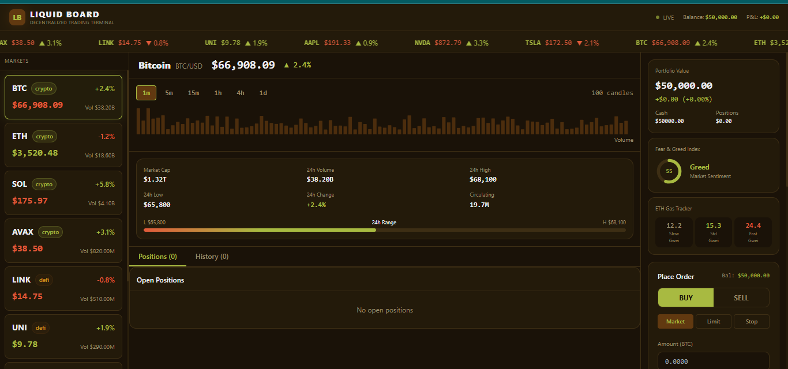
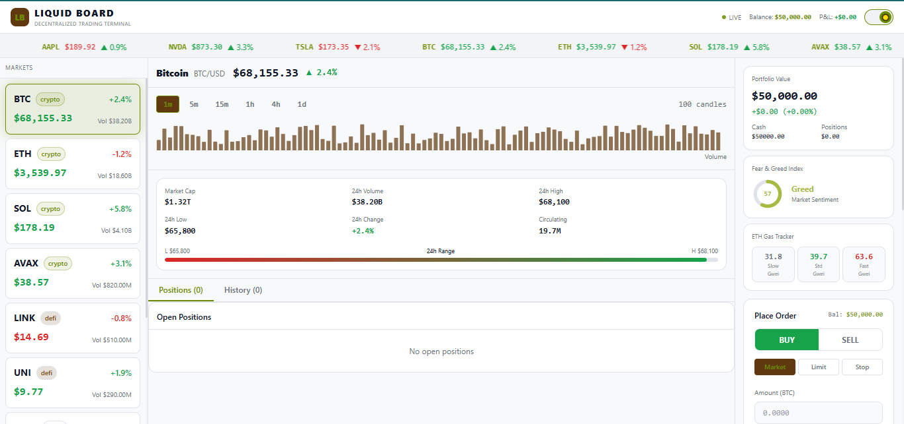

# LIQUID BOARD

**Decentralized Trading Terminal** — A real-time crypto & stock trading simulator built with Next.js, WebSockets simulation, and Recharts.

---

## Screenshots

### Dark Mode


### Light Mode


---

## Features

- **Live price simulation** — 9 assets tick every 1.5s with flash animations (BTC, ETH, SOL, AVAX, LINK, UNI, AAPL, NVDA, TSLA)
- **Real-time chart** — Area chart with volume bars, 6 timeframes (1m → 1d), OHLC tooltip
- **Order book** — Live bid/ask depth with visual fill bars, updates every 2s
- **Order panel** — Market, Limit & Stop orders with quantity presets, leverage slider (1–20x)
- **Portfolio tracker** — Open positions with real-time P&L, one-click close
- **Trade history** — Full log of all executed orders
- **Market stats** — Market cap, 24h volume, high/low range bar
- **Fear & Greed index** — Animated circular gauge with live sentiment
- **ETH Gas tracker** — Slow / Standard / Fast Gwei, updates every 5s
- **Animated ticker tape** — Scrolling price feed across the top
- **Dark / Light mode toggle** — Full theme switch, persisted to localStorage
- **Fully responsive** — Desktop 3-column terminal, tablet 2-column, mobile hamburger drawer

---

## Tech Stack

| Layer | Tech |
|---|---|
| Framework | Next.js 14 (App Router) |
| Language | TypeScript |
| Styling | Tailwind CSS + CSS custom properties |
| Charts | Recharts |
| Icons | Inline SVG |
| Deployment | Vercel |

---

## Getting Started

```bash
# Install dependencies
npm install

# Run dev server
npm run dev
```

Open [http://localhost:3000](http://localhost:3000)

---

## Project Structure

```
├── app/
│   ├── layout.tsx        # Root layout
│   ├── page.tsx          # Main trading terminal page
│   └── globals.css       # CSS variables (dark/light themes)
├── components/
│   ├── Chart.tsx         # Area chart + volume bars
│   ├── OrderBook.tsx     # Live bid/ask depth
│   ├── OrderPanel.tsx    # Buy/Sell order form
│   ├── Positions.tsx     # Open positions + P&L
│   ├── TradeHistory.tsx  # Executed trades log
│   ├── MarketStats.tsx   # 24h stats + range bar
│   ├── Widgets.tsx       # Portfolio, Fear/Greed, Gas tracker
│   ├── PriceCard.tsx     # Asset list card
│   ├── TickerTape.tsx    # Scrolling price ticker
│   ├── MobileMenu.tsx    # Hamburger drawer (mobile)
│   └── ThemeToggle.tsx   # Dark/light mode switch
├── hooks/
│   └── usePrices.ts      # Price simulation + gas + fear/greed hooks
└── lib/
    ├── mockData.ts       # Asset data, candle generation, order book
    └── wallet.ts         # Portfolio state, P&L calculations
```

---

## Deployment

Deployed on Vercel. Every push to `main` triggers an automatic redeploy.

[](https://vercel.com/new/clone?repository-url=https://github.com/Omachilda-Dev1/Liquid-Board)

---

## Color Palette

| Token | Dark | Light |
|---|---|---|
| Background | `#1a1208` | `#f8f9fa` |
| Surface | `#231a0a` | `#ffffff` |
| Accent (olive) | `#a8ba41` | `#6b8c00` |
| Brown | `#613910` | `#613910` |
| Up | `#a8ba41` | `#16a34a` |
| Down | `#e05a3a` | `#dc2626` |
